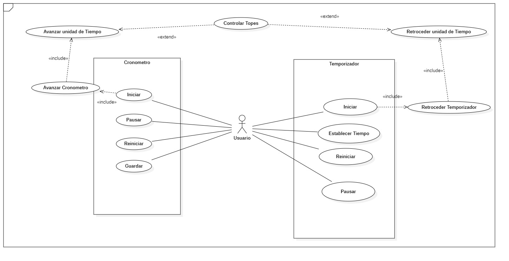
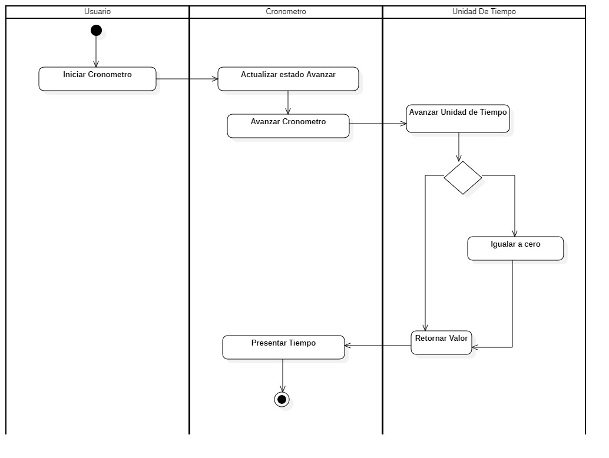

# Cronometro

---

# Integrantes
- Christian Caro -20181020027
- Neider Puentes - 20162021307
- Santiago Rios - 20181020017

# Solicitud de Proyecto

Se requiere la realización de un Cronometro que permita contar horas, minutos y Segundos, controlado mediante Botones, Como lo son, "Iniciar", "Parar", "Guardar Tiempo", "Reiniciar", deberá conservar por lo menos 10 tiempos en memoria, y se debe poder reestablecer. También el Cronometro servirá como contador, en el que se establecerá un tiempo, y el cronometro hará cuenta a cero, y notificara que ha acabado el tiempo.

Requerimientos Funcionales:

- Iniciar cronómetro
- Parar cronómetro
- Tomar tiempos
- Reiniciar cronómetro
- Iniciar temporizador
- Detener temporizador

Requerimientos No Funcionales

- Interfaz Gráfica que permita interactuar con el programa
Se crearán los diagramas necesarios para determinar el control y funcionamiento del proyecto, esto con el fin de determinar si los requerimientos mencionados son totalmente adecuados, o si se debe realizar algún otro proceso con el cliente para el desarrollo del proyecto. al mismo tiempo se iniciará la codificación de lo básico del proyecto.

Se Buscará realizar El cronometro en Java, con orientación a Objetos y la modelo vista controlador. Informando los cambios y procesos más significativos que se vayan obteniendo. Se integrará el cronometro y el Contador en una sola ventana, Creando un panel Numérico o Deslizante para Indicar el Tiempo, y ubicando de forma adecuada los botones para que la interacción sea lo más optima posible. Se manejará persistencia con archivos para conservar los tiempos, esto con el objetivo de que si cierran la aplicación los datos aún se mantengan, y que estos a su vez se puedan limpiar.

Definición de Tiempos y Costos

El cronómetro se realizará en tres fases:
1.  Mediante la realización de casos de uso entenderemos la interacción del usuario con el programa y a su vez las funcionalidades que éste utiliza. Además de esto haremos el análisis de requerimientos el cual consta de funcionales y no funcionales.
Seguido de esto, se realizará el diagrama de clases hecho de acuerdo con el MVC.
Para terminar esta primera fase, se concluirá con una primera codificación del cronómetro, ésta tendrá dos aspectos importantes los cuales son:
-	Implementar la estructura del cronómetro de acuerdo con el modelo, vista y controlador (MVC).
-	Asegurar la ejecución del cronometro de forma indefinida.
2. Se tiene una fase intermedia en la que se terminarán de implementar las funcionalidades restantes del cronómetro.
3. En la Tercera fase mediante pruebas unitaria se comprobará el correcto funcionamiento de la aplicación.
Cabe aclarar que es posible volver a la fase anterior en cualquier momento del desarrollo de la aplicación si es necesario.
 Se necesitará un total de tres estudiantes de ingeniería de sistemas, a los cuales se les pagara en total una suma de $300.000 COP, lo que quiere decir que les corresponde $100.000 COP a cada uno.
 
 # Proceso de Creación

 ## Diagramacion

### Se iniciara con los siguientes requerimientos.

| Requerimiento | Actores | Precondiciones | Escenarios | Poscondiciones| 
|--|--|--|--|--|
| Avanzar cronometro | Usuario | El cronometro esta pausado | ***1.1*** Cronometro indica a la unidad de tiempo mas pequeña que avance. ***1.2***  Los Unidad de tiempo retornana el valor al cronometro ***1.3*** Si el valor retornado es un cero el cronometro le indica a la siguente unidad de tiempo que avance ***1.4*** Este flujo se repite para las diferentes unidades de tiempo del cronometro ***2.1*** Si el cronometro no esta pausado el avanzar no es valido| El cronometro retorna el valor del tiempo en todas sus unidades a la interfaz de usuario|
| Avanzar unidad de tiempo | NA | El cronometro esta en estado de avanzar | ***1.1*** Cronometro indica a la unidad de tiempo que avance. ***1.2***  La unidad de tiempo incrementa su valor. ***1.3*** Si el valor iguala el tope el valor vuelve a cero. ***1.4*** La unidad de tiempo retorna su valor. ***2.1*** Si el cronometro no esta en estado de avanzar la unidad de tiempo no puede avanzar | El cronometro esta en estado de avanzar|
| Pausar Cronometro | Usuario | Cronometro en estado Avanzar | ***1.1*** Cronometro indica a la unidad de tiempo que no avance. ***1.2*** La unidad de Tiempo retornara el valor al Cronometro. ***1.3*** El cronometro mostrara que la unidad de tiempo no avanza en la interfaz de usuario. ***2.1*** Si el Cronometro no esta en estado de Avanzar, Pausar no estara disponible. | El cronometro queda en estado Pausado (El tiempo No avanza pero mantiene la Unidad)|
| Reiniciar Cronometro | Usuario | Cronometro En estado Avanzar o Pausado | ***1.1*** Cronometro Indica a la Unidad de Tiempo y a la Memoria Retornar a su Estado Inicial ***1.2*** La unidad de Tiempo retornara el Valor al Cronometro ***1.3*** La memoria retornara los datos en ella ***1.4*** El cronometro Mostrara en cero el tiempo ***1.5*** El cronometro Mostrara la memoria Vacia ***2.1*** Si el cronometro no esta en estado Pausado Resetear no estara Disponible. | Tiempo seteado en Cero y unidad No avanza, Memoria borrada| 
| Guardar Tiempo | Usuario | Cronometro en estado Avanzar | ***1.1*** El cronometro indica a la memoria captura el valor de las unidades de tiempo Actual ***1.2*** La memoria Obtiene el valor actual de la Unidad de tiempo y Lo almacena en una Lista ***1.3*** La memoria Retorna la Lista ***1.4*** El cronometro Muestra en la interfaz de Usuario La lista de Tiempos almacenados ***2.1*** Si el Cronometro no esta en estado Avanzar La memoria No esta disponible para almacenar tiempos | Se muestra una lista de tiempos guardados en memoria| 
| Setear Tiempo Temportizador | Usuario | Tiempo en estado de no avanzar |***1.1*** El Usuario Digita la unidad de Tiempo que desea ***1.2*** El Temporizador envia a la Unidad de Tiempo el valor que el Usuario Digito ***1.3***  La unidad de Tiempo Almacena como estado Secundario el Valor que Recibe y Se Retorna Como unidad de Tiempo inicial ***1.4*** El Temporizador muestra la unidad de tiempo que el usuario desea ***2.1*** Si el temporizador no esta en estado Inicial, setear tiempo no estará habilitado | Unidad de Tiempo inicial con el valor ingresado por el Usuario| 
| Iniciar Temporizador | Usuario | Tiempo Seteado | ***1.1*** El temporizador indica a la Unidad de tiempo mas pequeña retroceder ***1.2*** La unidad de tiempo Reduce su Valor ***1.3*** Si el valor retornado es el tope, el temporizador le indica a la otra unidad que decremente ***1.4*** El ciclo se repite para todas las demas unidades de tiempo ***1.5*** El temporizador muestra el valor de la unidades de tiempo en la interfaz de usuario ***2.1*** Si el Temporizador no tiene Tiempo Seteado, El temporizador no Iniciará ***2.1*** Si el temporizador esta en estado pausado, inciar estará habilitado | El temporizador Muestra el valor de la unidades a la interfaz de usuario| 
| Retroceder Unidad de Tiempo | NA | Temporizador en estado iniciar | ***1.1*** El temporizador indica a la unidad de tiempo que retroceda ***1.2*** La unidad de tiempo, decrementa su valor ***1.3*** Si el valor es igual a cero, el valor vuelve al tope ***1.4*** La unidad de Tiempo Retorna el Valor ***2.1*** SI el temporizador no esta en estado Retroceder, la unidad de tiempo no decrementa | El temporizador queda en estado Retroceder| 
| Alarma Temporizador | NA | Temporizador en estado Retroceder | ***1.1*** El Temporizador Verifica que Todas las unidades de tiempo sean iguales a cero ***1.2*** El temporizador indica a las unidades de tiempo no retroceder ***1.3*** El temporizador Generara una alarma indicando que el tiempo seteado por el Usuario ha terminado ***1.4*** Despues de algunos segundo, el Temporizador se reiniciara en estado Nulo ***2.1*** Si el temporizador no esta en estado avanzar, la alarma no se generara ***2.2*** Si el termporizador no ha llegado a cero, la alarma no se generara | Sonido que indique que la unidad de tiempo ha llegado a Cero, y el temporizador Acabo, monstrandolo en la interfaz de Usuario| 
| Pausar Temporizador | Usuario | Temporizador en estado Retroceder | ***1.1*** El temporizador le indica a la unidad de tiempo mas pequeña no decrementar ***1.2*** La unidad de Tiempo dejara de decrementar ***1.3*** El temporizador Mostrara en la interfaz la unidad de tiempo ***2.1*** Si el temporizador no esta en estado retroceder, pausar no estara disponible ***2.2*** Si el temporizador no tiene tiempo seteado, pausar no estara disponible ***2.3*** Si el temporizador ya ha llegado a cero, Pausar no estara disponible | El temporizador Retorna el tiempo en estado Pausado a la interfaz de Usuario|
| Resetear Temporizador | Usuario | Temporizador en estado Pausado | ***1.1*** El temporizador Indica a cada Unidad de tiempo Volver a estado inicial ***1.2*** La unidad de tiempo se setea con valor igual a cero ***1.3*** El temporizador muestra en la interfaz la Unidad de tiempo ***2.1*** Si el temporizador esta en estado avanzar, resetear no estara disponible ***2.2*** Temporizador no Tendra memoria para almacenar tiempos | El temporizador resetea el Tiempo seteado o actual en la unidad de tiempo y retorna el cero a la interfaz de Usuario|
| Reiniciar Unidad de Tiempo | NA | Cronometro O temporizador en estado pausado | ***1.1*** Hay una orde de Volver a un estado inicial ***1.2*** La unidad de Tiempo tendra valor igual a cero ***1.3*** La unidad de tiempo retornara al valor ***2.1*** el estado es avanzar o retroceder, la unidad de Tiempo no se reseteara | La unidad de tiempo retornara en cero el valor a la interfaz de usuario| 
| Resetear Memoria | NA | Cronometro en estado pausado | ***1.1*** El cronometro indica Resetear la Memoria ***1.2*** La memoria Deletea la lista de tiempo obtenidos con anterioridad ***1.3*** La memoria retornara la Lista ***2.1*** Si la lista esta vacia, esta no se reseteara ***2.1*** Si el cronometro no esta en estado Pausar, la memora no se reseteará | La memoria Retornara vacia la lista de datos que puede almacenar| 
| Requerimiento | Actores | Precondiciones | Escenarios | Poscondiciones| 
| Requerimiento | Actores | Precondiciones | Escenarios | Poscondiciones|
# Diagramas Cronometro

 ##  Diagrama de Casos de uso: 
  

# Diagramas Cronometro

## Diagrama Actividad Iniciar

## Diagrama Actividad Pausar

## Diagrama Actividad Reiniciar

## Diagrama Actividad Guardar Tiempo

## Diagrama De Flujo de Datos Cronometro

# Diagramas Temporizador

## Diagrama Actividad Iniciar

## Diagrama Actividad Pausar

## Diagrama Actividad Reiniciar

## Diagrama Actividad Setear Tiempo

## Diagrama De Flujo de Datos Temporizador

# Primer Diagrama de Clases
* 

## Algunas Secuencias en el proceso de Datos

### Diagrama De Secuencia de Inicio Cronometro

### Diagrama De Secuencia de Pausa Cronometro

### Diagrama De Secuencia de Reinicio Cronometro

### Diagrama De Secuencia de Guardar Tiempo

### Diagrama De Secuencia de Inicio Temporizador

### Diagrama De Secuencia de Pausar Temporizador

### Diagrama De Secuencia de Reiniciar Temporizador

### Diagrama De Secuencia de Seteo de Tiempo

